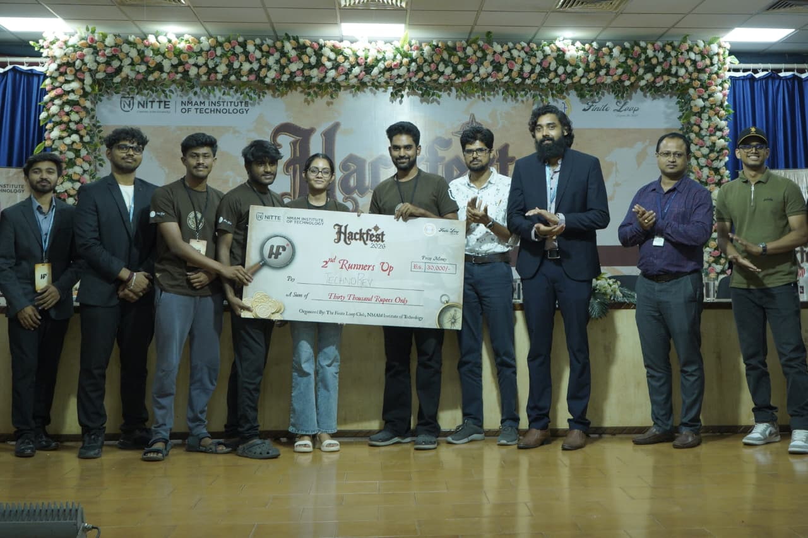
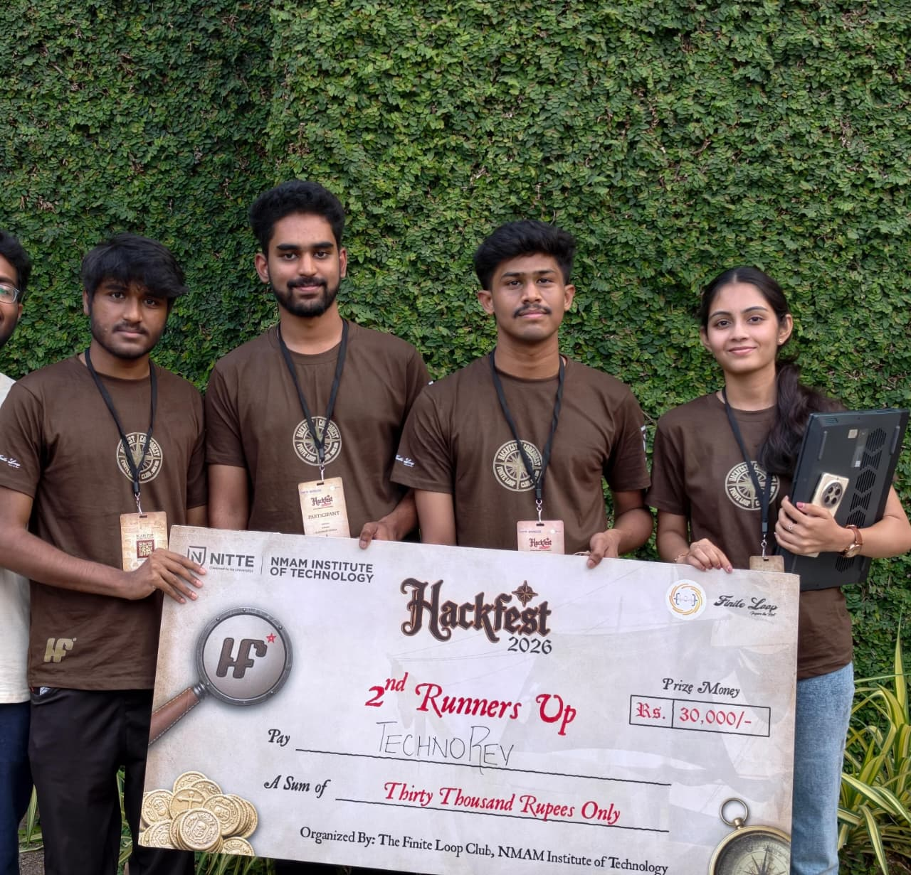
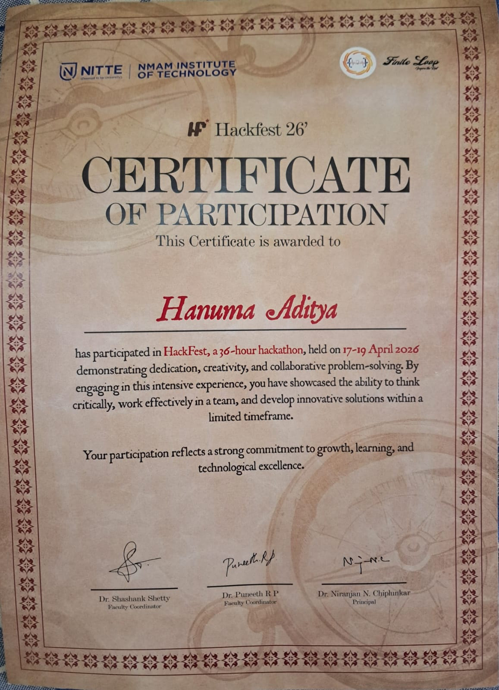
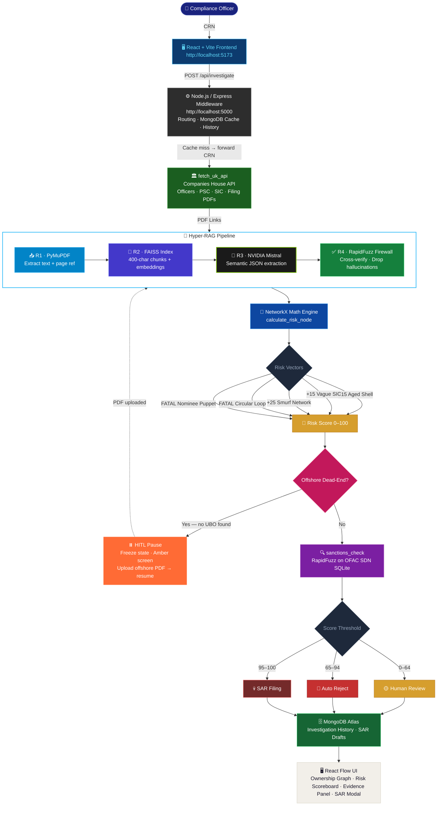
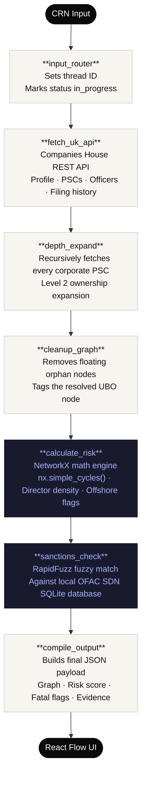
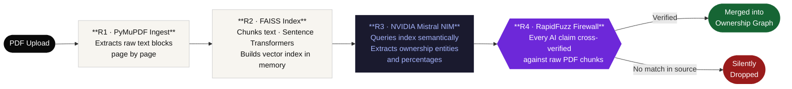

# 🔍 Project Unshell
### Autonomous AML & KYB Intelligence Graph

> **Hackfest 2026 · Team technorev · NMAMIT**

[](https://fastapi.tiangolo.com)
[](https://expressjs.com)
[](https://react.dev)
[](https://langchain-ai.github.io/langgraph/)
[](https://mongodb.com)
[](https://python.org)

---

## 🏆 Awards

| | | |
|:---:|:---:|:---:|
|  |  |  |

---

## 🎥 Demo Video (5 min)

[](https://youtu.be/iBJjzfc9T_4)

---

## What is Project Unshell?

Financial criminals don't walk through the front door. They hide behind **layers of shell companies, nominee directors, and offshore trusts** — making it nearly impossible for a compliance analyst to trace the real beneficial owner.

**Project Unshell** is a fully autonomous AML & KYB (Know Your Business) investigation platform. You give it a UK Company Registration Number. It returns a **complete, evidence-backed forensic ownership graph** — with risk scores, sanctions flags, and circular loop detection — in under 10 seconds.

> A task that takes a senior compliance analyst **3 days** takes Unshell less than **10 seconds**.

---

## The Problem It Solves

| Manual KYB Today | With Unshell |
|---|---|
| Analyst reads 50-page PDFs manually | Hyper-RAG pipeline extracts ownership automatically |
| Circular loops missed by human eye | `nx.simple_cycles()` detects mathematically |
| Nominee directors not flagged | Director density algorithm fires `NOMINEE_PUPPET` |
| OFAC check done separately | Built-in fuzzy SDN match, score → 100 instantly |
| No source evidence | Every claim links to exact PDF page + chunk |
| SAR takes hours to draft | Gemini 2.5 Flash generates a full SAR in seconds |
| Days of work | Under 10 seconds |

---

## Architecture

### Full System Architecture



---

### LangGraph Investigation Pipeline

The investigation runs as a **6-node LangGraph stateful pipeline** — each node is a discrete Python function wired together by LangGraph's state machine.



---

### Hyper-RAG Pipeline (Document Mode)

When an offshore PDF is uploaded, a 4-stage pipeline extracts ownership entities from unstructured legal documents.



> **Zero-Trust AI:** The RapidFuzz Firewall (R4) is our core differentiator. An AI claim only reaches the graph if the entity name and percentage can be found verbatim in the raw source document. Unverified claims are silently dropped — no hallucinations reach the output.

---

## Risk Scoring Engine

The `NetworkX` graph engine runs **6 deterministic risk vectors** — pure math, zero AI opinion:

| Flag | Trigger | Score Impact |
|---|---|---|
| `CIRCULAR_LOOP` | `nx.simple_cycles()` detects ownership cycle | +100 (Fatal) |
| `NOMINEE_PUPPET` | Director appointed across 100+ companies | +75 (Fatal) |
| `OFAC_MATCH` | RapidFuzz match on US Treasury SDN list | Score → 100 |
| `OFFSHORE_WALL` | PSC jurisdiction outside UK/EEA | +30 |
| `AGED_SHELL` | Incorporation >10yrs, <5 filings | +15 |
| `VAGUE_SIC` | High-risk SIC code (74990, 99999) | +10 |

**Score thresholds:** `< 30` Auto-Approve · `30–64` Human Review · `65–94` Auto-Reject · `≥ 95` SAR Filing Required

---

## Tech Stack

| Layer | Technology |
|---|---|
| **Frontend** | React 19 + Vite 8, XYFlow / React Flow (ownership graph), Tailwind CSS |
| **Middleware** | Node.js / Express 4, Mongoose, MongoDB Atlas (history & SAR cache) |
| **AI Service** | FastAPI + asyncio, Uvicorn |
| **Orchestration** | LangGraph (stateful 6-node workflow) |
| **AI Extraction** | NVIDIA NIM Mistral (structured entity extraction) |
| **PDF Reading** | Google Gemini 2.5 Flash (document mode, Hyper-RAG) |
| **RAG Engine** | PyMuPDF + Sentence Transformers + FAISS |
| **Verification** | RapidFuzz token-sort firewall (Zero-Trust AI) |
| **Graph Math** | NetworkX (topology, cycle detection, centrality) |
| **Sanctions** | SQLite OFAC SDN database (local, offline) |
| **Data Broker** | FastMCP server (port 8002) — zero credential leakage |

---

## Project Structure

```
unshell/
├── node-backend/                    # Express.js middleware layer
│   ├── server.js                    # Entry point — CORS, routes, MongoDB connect
│   ├── config/
│   │   └── db.js                    # Mongoose connection
│   ├── controllers/
│   │   └── investigateController.js # Business logic, same-day cache, SAR
│   ├── models/
│   │   └── Investigation.js         # Mongoose schema (history + SAR drafts)
│   ├── routes/
│   │   └── investigate.js           # /api/investigate, /api/history, /api/sar
│   ├── services/
│   │   └── aiServiceClient.js       # Axios proxy to Python AI service
│   └── .env                         # PORT, MONGO_URI, AI_SERVICE_URL
│
├── ai-service/                      # Python FastAPI AI pipeline
│   ├── main.py                      # FastAPI entry point (port 8001)
│   ├── agent/
│   │   ├── orchestrator.py          # LangGraph 6-node pipeline
│   │   ├── sar_generator.py         # Gemini 2.5 Flash SAR draft generator
│   │   └── state.py                 # InvestigationState TypedDict
│   ├── ai/
│   │   ├── fetch_ch.py              # Companies House API client
│   │   ├── ch_parser.py             # PSC/officer → graph node parser
│   │   ├── gemini_extractor.py      # Gemini PDF extraction (doc mode)
│   │   ├── gemini_normalizer.py     # Gemini output normalizer
│   │   └── nvidia_normalizer.py     # NVIDIA NIM output normalizer
│   ├── graph/
│   │   └── engine.py                # NetworkX risk scoring engine
│   ├── mcp/
│   │   └── server.py                # FastMCP credential broker (port 8002)
│   ├── data/
│   │   └── sanctions.db             # OFAC SDN SQLite database
│   └── requirements.txt
│
└── frontend/                        # React + Vite SPA
    └── src/
        ├── App.jsx                  # Root — state machine & routing
        ├── api/                     # Backend API calls
        ├── constants/               # Shared design tokens
        └── components/
            ├── DualEntryGateway.jsx    # Landing page / CRN input
            ├── LoadingScreen.jsx       # Live pipeline progress UI
            ├── InvestigationView.jsx   # Main forensic dashboard
            ├── GraphCanvas.jsx         # React Flow ownership graph
            ├── CustomNode.jsx          # Graph node renderer
            ├── EntitySidebar.jsx       # Entity list + stats sidebar
            ├── EvidencePanel.jsx       # Source evidence drawer
            ├── RiskScoreboard.jsx      # Risk score bottom bar
            ├── HitlUploadZone.jsx      # HITL offshore PDF upload
            └── SarDraftModal.jsx       # AI-generated SAR modal
```

---

## Setup & Running Locally

### Prerequisites
- Python 3.11+
- Node.js 18+
- MongoDB Atlas account (free M0 cluster)
- API keys (see below)

### 1. Clone & configure

```bash
git clone https://github.com/Hanuaditya/unshell.git
cd unshell
```

**`ai-service/.env`**
```env
COMPANIES_HOUSE_API_KEY=your_key_here
GEMINI_API_KEY=your_key_here
NVIDIA_API_KEY=your_key_here
```

**`node-backend/.env`**
```env
PORT=5000
MONGO_URI=your_mongodb_atlas_uri
AI_SERVICE_URL=http://localhost:8001
```

### 2. Python AI Service (port 8001)

```bash
cd ai-service
pip install -r requirements.txt
uvicorn main:app --reload --port 8001
```

### 3. Node.js Middleware (port 5000)

```bash
cd node-backend
npm install
npm run dev        # uses nodemon for hot-reload
# or: npm start   # production
```

### 4. Frontend (port 5173)

```bash
cd frontend
npm install
npm run dev
```

Open **http://localhost:5173**

### Demo CRNs to Try

| Company | CRN | Expected Result |
|---|---|---|
| Monzo Bank | `09446231` | Low risk, clean structure |
| IBS Group | `01683457` | Medium risk |
| Seabon Ltd | `06026625` | Critical — OFAC linked |

---

## API Reference

### Node.js Middleware (`:5000`)

| Endpoint | Method | Description |
|---|---|---|
| `/health` | GET | Service health check |
| `/api/investigate` | POST | `{ "crn": "09446231" }` → full investigation (cached same-day) |
| `/api/investigate/sar` | POST | `{ "crn": "..." }` → generate SAR draft (score ≥ 65) |
| `/api/history` | GET | Paginated investigation history (`?page=1&limit=10`) |
| `/api/history/:crn` | GET | Full history for a specific CRN |

### Python AI Service (`:8001`)

| Endpoint | Method | Description |
|---|---|---|
| `/health` | GET | AI service health check |
| `/investigate` | POST | `{ "crn": "..." }` → LangGraph pipeline result |
| `/investigate/document` | POST | Multipart PDF upload → document mode investigation |
| `/generate_sar` | POST | Structured payload → Gemini SAR draft |

---

## How to Get API Keys

| Key | Where to Get |
|---|---|
| Companies House | [developer.company-information.service.gov.uk](https://developer.company-information.service.gov.uk) — free |
| Gemini | [aistudio.google.com](https://aistudio.google.com) — free tier |
| NVIDIA NIM | [build.nvidia.com](https://build.nvidia.com) — free credits |
| MongoDB Atlas | [mongodb.com/atlas](https://www.mongodb.com/atlas) — free M0 cluster |

---

## Screenshots

### 1. Landing Page — Start an Investigation

Enter any UK Company Registration Number (CRN) and hit **Investigate**. Three demo companies are pre-loaded — Monzo (low risk), IBS (medium), and Seabon (critical OFAC-linked) — so you can jump straight into a live investigation. The system runs entirely off the UK Companies House public API with no manual data entry required.


---

### 2. Investigation in Progress — Live Pipeline View

Once you submit a CRN, Unshell's 6-stage autonomous pipeline kicks in. Each step completes in real time — from fetching the company registry and building the ownership graph, to running cycle detection and screening against OFAC sanctions. The orbital spinner on the left confirms the pipeline is actively running. Progress is tracked as a step counter (e.g. `3/6`).


---

### 3. Full Forensic Dashboard — SATUS 2026-1 PLC

This is the complete investigation output. **SATUS 2026-1 PLC** returned a **Risk Score of 90/100** triggering an **AUTO REJECT** verdict. The graph reveals a classic nominee puppet structure — a holding company flagged as `NOMINEE PUPPET` holds over 75% shares, controlled by a corporate director network. The left sidebar shows all 6 entities, 1 puppet detected, depth-2 chain traced, and the exact rejection rationale. Every edge on the graph is clickable, showing the source evidence behind each relationship.


---

## Team

**Team technorev · NMAMIT · Hackfest 2026**

| Role | Name |
|---|---|
| LangGraph & Backend | Srihari BT |
| Backend | Hanumaditya |
| Frontend | Nehalika |
| Frontend | Sagar |

---

## License

MIT © 2026 Team technorev
